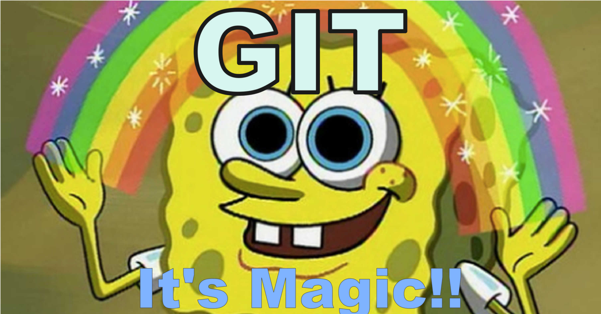

# git demystified

[ PT | EN ]

## PT:

Esta apresentação tenta ser um bom ponto de partida para quem planeia começar a aprender Git, é focada em:

* benefícios
* conceitos base

### Como aceder

A framework de apresentações reveal.js é usado como um submódulo, então o projeto deve ser clonado com a opção ```--recurse-submodules```

     git clone --recurse-submodules git@github.com:jfig/git-demystified-presentation.git

Depois disso, basta abrir o ficheiro ```index.html``` no seu  web browser favorito.

## EN:

This presentation tries to be starting point to those planning to learn Git, it focuses on:

* benefits
* basic concepts

### Setup

The presentation framework reveal.js is used as a submodule, so the project must be cloned to with ``` --recurse-submodules```

    git clone --recurse-submodules git@github.com:jfig/git-demystified-presentation.git

After this just open the ```index.html``` file in your favorite web browser.

## Agradecimentos / Thanks

Hakim El Hattab (http://hakim.se) for the  presentation framework **reveal.js** (https://github.com/hakimel/reveal.js)

laboratorio linux  (https://www.flickr.com/photos/133825397@N08/) for the Linus Torvalds photo (https://www.flickr.com/photos/133825397@N08/40926138602)

Larry Ewing, Simon Budig, Garrett LeSage - http://www.home.unix-ag.org/simon/penguin/, for the Tux on GitHub, CC0, https://commons.wikimedia.org/w/index.php?curid=753970

GitLab form the "git-branches" image, (https://oer.gitlab.io/oer-on-oer-infrastructure/Git-introduction.html#/slide-git-demo)
